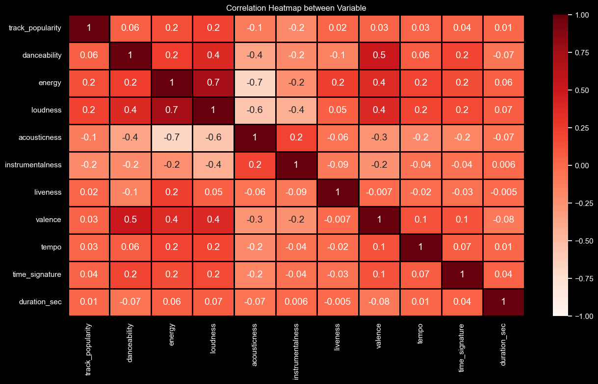

# <h1 align="center"> Spotify Data Analysis Project - Using Python  And Tableau 

# Introduction

**Spotify**, founded in 2008, has redefined music consumption globally. With over 70 million tracks and personalized recommendations, it offers both free and premium options. Serving as a virtual stage for artists, it fosters a sense of community through curated playlists and podcasts. Welcome to a world where music knows no bounds.

> [!IMPORTANT]
> Codes? Check them out from here: [*codes*](./codes/)

# Background

- **Project focus:** Analyzing music data insights using **Tableau** with **Spotify** datasets.

- **Initial steps:** Conducted data cleaning and exploratory analysis using **Python**.

- **Key analysis:** Explored correlations between a song's audio features and lyrical sentiment through sentiment analysis.

- **Utilization of secondary data:** Leveraged **Spotify's** datasets to identify patterns and relationships among various characteristics.

- **Outcome:** Enhanced proficiency in interpreting datasets effectively and deepened understanding of music analytics.

> [!IMPORTANT]
> [**Dashboard**](https://public.tableau.com/views/SpotifyInsights_17116210915230/SpotifyInsights?:language=en-US&:sid=&:display_count=n&:origin=viz_share_link) 

# Tools

- [**Python**](https://python.org/) 

  - **Python** stands as our cornerstone programming language, offering unparalleled versatility for data analysis, manipulation, and visualization. Supported by indispensable libraries.
  - **Libraries:** [**Pandas**](https://pandas.pydata.org/)  | [**NumPy**](https://numpy.org/)  | [**Matplotlib**](https://matplotlib.org/)  | [**Seaborn**](https://seaborn.pydata.org/) 
    - **_Pandas:_** Empowers us with robust data manipulation and analysis capabilities.
    - **_NumPy:_** This powerful numerical computing library is instrumental in handling complex mathematical operations efficiently.
    - **_Matplotlib:_** Our go-to plotting library, **Matplotlib** ensures comprehensive visualization tailored to our analytical needs.
    - **_Seaborn_:** Leveraging **Matplotlib's** foundation, **Seaborn** provides a higher-level interface, simplifying the creation of insightful visualizations.

- [**Jupyter Notebook**](https://jupyter.org/) 

  - **Jupyter Notebook** serves as our interactive playground for data exploration and analysis. Its unique features, including code execution in cells and markdown support for documentation, foster clarity and reproducibility in our analyses.

- [**Visual Studio Code**](https://code.visualstudio.com/) 

  - As the primary integrated development environment, **Visual Studio Code** provides a user-friendly interface for coding and version control, enhancing productivity and ease of collaboration.

- **[Git](https://git-scm.com/)  & [GitHub](https://github.com/) **

  - **Git** is utilized for version control and collaborative development, while **GitHub** serves as the repository hosting platform. These tools facilitate efficient team collaboration and ensure the integrity and traceability of project versions.

- [**Tableau**](https://www.tableau.com/) 
  - **Tableau** is employed for crafting interactive dashboards and visualizations, effectively presenting insights gleaned from analyzed data. Its intuitive drag-and-drop interface and robust visualization capabilities enable the creation of compelling and informative dashboards that enhance data communication and decision-making processes.

# Objectives

1. **Importing Dataset**

> [!TIP]
> Code: [Importing Dataset](./codes/1_Importing_Dataset.ipynb)

2. **Data Collection And Preprocessing**

> [!TIP]
> Code: [Data Collection And Preprocessing](./codes/2_Data_Collection_And_Preprocessing.ipynb)

3. **Top 25 Most Popular Songs On Spotify**

> [!TIP]
> Code: [Top 25 Most Popular Songs](./codes/3_Top_25_Most_Popular_Songs.ipynb)

| Track Name                                                 | Artist            | Track Popularity | Release Year | Release Month |
| ---------------------------------------------------------- | :---------------: | :--------------: | :----------: | ------------: |
| Cruel Summer                                               | Taylor Swift      | 99             | 2019         | August        |
| All I Want For Christmas Is You                            | Mariah Carey      | 99             | 1994         | October       |
| My Love Mine All Mine                                      | Mitski            | 98             | 2023         | September     |
| Perro Negro                                                | Bad Bunny         | 97             | 2023         | October       |
| Monaco                                                     | Bad Bunny         | 96             | 2023         | October       |
| Que Onda                                                   | Calle 24          | 95             | 2023         | August        
| As It Was                                                  | Harry Styles      | 94             | 2022         | May           
| Starboy                                                    | The Weeknd        | 94             | 2016         | November      |
| Is It Over Now? (Taylor'S Version) (From The Vault)        | Taylor Swift      | 94             | 2023         | October       |
| One Of The Girls (With Jennie, Lily Rose Depp)             | The Weeknd        | 94             | 2023         | June          |
| What Was I Made For? [From The Motion Picture "Barbie"]    | Billie Eilish     | 94             | 2023         | July          |
| Sweater Weather                                            | The Neighbourhood | 93             | 2013         | April         |
| Flowers                                                    | Miley Cyrus       | 93             | 2023         | August        |
| Idgaf (Feat. Yeat)                                         | Drake             | 93             | 2023         | October       |
| Fukumean                                                   | Gunna             | 93             | 2023         | June          |
| Jingle Bell Rock                                           | Bobby Helms       | 93             | 1957         | December      |
| Anti-Hero                                                  | Taylor Swift      | 92             | 2022         | October       |
| I'M Good (Blue)                                            | David Guetta      | 92             | 2022         | August        |
| You’Re Losing Me (From The Vault)                          | Taylor Swift      | 92             | 2023         | November      |
| I Know ?                                                   | Travis Scott      | 91             | 2023         | July          |
| Something In The Orange                                    | Zach Bryan        | 91             | 2022         | April         |
| Now That We Don'T Talk (Taylor'S Version) (From The Vault) | Taylor Swift      | 91             | 2023         | October       |
| No Role Modelz                                             | J. Cole           | 91             | 2014         | December      |
| Without Me                                                 | Eminem            | 91             | 2002         | May           |
| Don’T Blame Me                                             | Taylor Swift      | 91             | 2017         | November      |

4. **Top 25 Least Popular Songs On Spotify**

> [!TIP]
> Code: [Top 25 Least Popular Songs](./codes/4_Top_25_Least_Popular_Songs.ipynb)

| Track Name                                          | Artist           | Track Popularity | Release Year | Release Month |
|--------------------------------------------------|:------------------:|:----------------:|:------------:|--------------:|
| Intro                                              | AB                   | 0                | 2023         | April         |
| I Need Thee/I'M Yours Everyday (Reprise)           | Chris Bethel         | 0                | 2005         | July          |
| High Places                                        | Chris Bethel         | 0                | 2005         | July          |
| Sleep Music                                        | Spa Music Relaxation | 0                | 2022         | April         |
| Endless Love                                       | Chris Bethel         | 0                | 2019         | October       |
| High Places                                        | Chris Bethel         | 0                | 2019         | October       |
| Then Came You (Extended Version)                   | Chris Bethel         | 0                | 2019         | October       |
| Monologue (Destined 4 Worship)                     | brian gregory        | 0                | 2005         | July          |
| Easy Going                                         | Spa Music Relaxation | 0                | 2022         | April         |
| You Are Good                                       | Chris Bethel         | 0                | 2019         | October       |
| My Eyes Are On You                                 | Chris Bethel         | 0                | 2005         | July          | 
| Without You                                        | Chris Bethel         | 0                | 2019         | October       |
| No One Compares 2 U                               | Chris Bethel          | 0                | 2005         | July          |
| Warm Feelings Inside                              | Spa Music Relaxation  | 0                | 2022         | April         |
| Everyday                                           | Chris Bethel         | 0                | 2005         | July          |
| Word Of God Speak                                  | Chris Bethel         | 0                | 2005         | July          |
| Then Came You (Radio)                              | Chris Bethel         | 0                | 2019         | October       |
| In His Presence                                    | Chris Bethel         | 0                | 2005         | July          |
| Strength                                           | Chris Bethel         | 0                | 2005         | July          |
| Calm Seas                                          | Spa Music Relaxation | 0                | 2022         | April         |
| Yoga Relaxation                                   | Spa Music Relaxation  | 0                | 2022         | April         |
| Lucid                                              | Spa Music Relaxation | 0                | 2022         | April         |
| Planet In Flux                                     | Spa Music Relaxation | 0                | 2022         | April         |
| Calming Breeze                                     | Spa Music Relaxation | 0                | 2022         | April         |
| Wellbeing                                          | Spa Music Relaxation | 0                | 2022         | April         |

5. **Correlation Heatmap Between Variable**

[**Heatmap**](./assets/Heatmap.png) 

6. **Correlation Between Popularity And Acousticness**

[**Popularity vs Acousticness**](https://public.tableau.com/views/SpotifyInsights_17116210915230/CorrPopularityvsAcousticness?:language=en-US&:sid=&:display_count=n&:origin=viz_share_link) 

7. **Correlation Between Loudness And Energy**

[**Loudness vs Energy**](https://public.tableau.com/views/SpotifyInsights_17116210915230/CorrLoudnessvsEnergy?:language=en-US&:sid=&:display_count=n&:origin=viz_share_link) 

8. **Total Number of Songs On Spotify**

[**Total Songs**](https://public.tableau.com/views/SpotifyInsights_17116210915230/TotalSongs?:language=en-US&:sid=&:display_count=n&:origin=viz_share_link) 

9. **Top 25 Followed Artists On Spotify**

[**Most Followed**](https://public.tableau.com/views/SpotifyInsights_17116210915230/MostFollowed?:language=en-US&:sid=&:display_count=n&:origin=viz_share_link) 

10. **Top 10 Genre On Spotify**

[**Top 10 Genre**](https://public.tableau.com/views/SpotifyInsights_17116210915230/Top10Genres?:language=en-US&:sid=&:display_count=n&:origin=viz_share_link) 

# Resources

> [!NOTE]
> **Database File:** [Link to the Database](https://www.kaggle.com/datasets/tonygordonjr/spotify-dataset-2023?select=spotify_data_12_20_2023.csv)

> **Source:** [Kaggle](https://www.kaggle.com/) 
